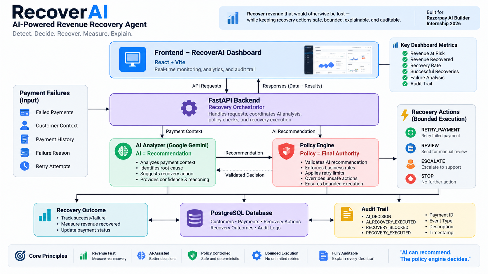

# RecoverAI

## AI-Powered Revenue Recovery Agent

RecoverAI is an AI-powered revenue recovery system that identifies failed payments, analyzes the likely cause, recommends the safest recovery action, and executes bounded recovery workflows under deterministic policy guardrails.

The system is designed around one core objective:

> **Recover revenue that would otherwise be lost — while keeping recovery actions safe, bounded, explainable, and auditable.**

---

## 🚀 What Problem Does RecoverAI Solve?

Payment failures create revenue leakage.

A failed payment does not always mean permanently lost revenue. Some failures are temporary and recoverable, while others require review, escalation, or no further action.

The challenge is deciding:

- Which payments are worth recovering?
- Why did the payment fail?
- Should the system retry?
- When should retries stop?
- When should the case be escalated?
- How much revenue was actually recovered?
- Can every decision be explained and audited?

RecoverAI addresses this through an AI-assisted recovery decision pipeline.

---

## 💡 Solution

RecoverAI combines:

**AI analysis + deterministic policy guardrails + bounded execution + outcome measurement + audit trails**

The AI analyzes the payment context and recommends an intervention.

However, AI does **not** have final authority.

A deterministic policy engine validates the recommendation and enforces recovery limits.

### Decision Flow

```text
Failed Payment
      ↓
Payment & Customer Context
      ↓
AI Recovery Analysis
      ↓
Root Cause + Risk + Recommendation
      ↓
Deterministic Policy Engine
      ↓
┌───────────────┬────────────┬─────────────┐
│ RETRY         │ REVIEW     │ ESCALATE    │
└───────────────┴────────────┴─────────────┘
      ↓
Bounded Recovery Action
      ↓
Recovery Outcome
      ↓
Revenue Recovered
      ↓
Audit Trail

