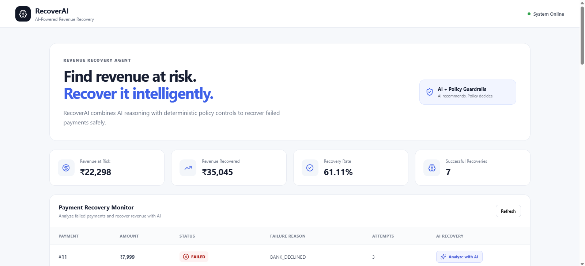
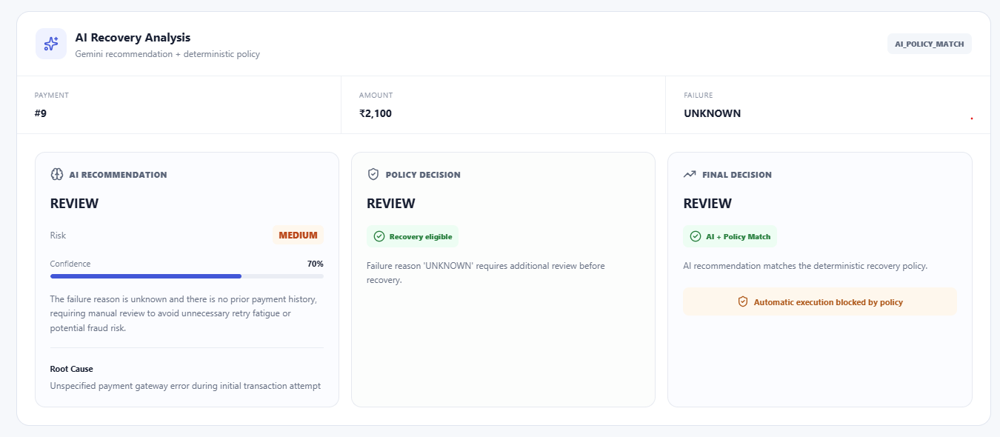
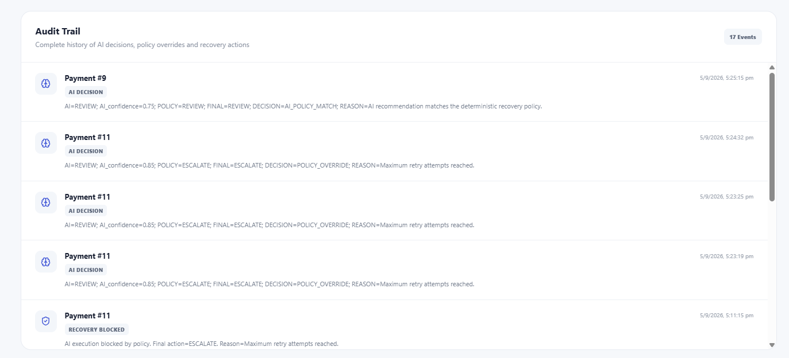
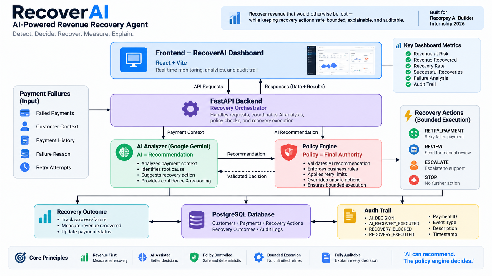

# RecoverAI — AI-Powered Revenue Recovery Agent

RecoverAI is an AI-powered revenue recovery system that analyzes failed payments, recommends the safest recovery action, validates that recommendation through deterministic policy guardrails, executes only bounded recovery workflows, measures recovered revenue, and maintains an auditable decision trail.

> **Core principle:** AI can recommend. The policy engine decides.

## 🚀 Live Demo

**Live Application:** https://recover-ai-lemon.vercel.app

**GitHub Repository:** https://github.com/mustafaelectricwala13/RecoverAI

**Backend API:** https://recoverai-backend-pxa6.onrender.com

**API Documentation:** https://recoverai-backend-pxa6.onrender.com/docs

> RecoverAI uses simulated recovery execution for demonstration. It does not process real payments.

---

## 🎯 Problem

Failed payments create revenue leakage.

A failed payment does not always mean permanently lost revenue. Some failures may be temporary and recoverable, while others should be reviewed, escalated, or stopped after safety limits are reached.

A revenue recovery system therefore needs to answer:

- Why did the payment fail?
- Is the failure recoverable?
- Should the payment be retried?
- When should retries stop?
- When should a case be escalated?
- How much revenue was recovered?
- Can every decision and execution be explained and audited?

---

## 💡 Solution

RecoverAI combines:

**AI analysis + deterministic policy guardrails + bounded execution + outcome measurement + audit trails**

The AI analyzes payment and customer context and recommends one recovery action:

- `RETRY_PAYMENT`
- `REVIEW`
- `ESCALATE`
- `STOP`

The deterministic policy engine remains the final authority.

This separation prevents the AI from independently performing unsafe or unlimited recovery actions.

---

## 🧠 How It Works

```text
Failed Payment
      ↓
Payment + Customer Context
      ↓
Gemini AI Analysis
      ↓
Root Cause + Risk + Recommendation
      ↓
Deterministic Policy Engine
      ↓
Final Approved Action
      ↓
Bounded Recovery Execution
      ↓
Recovery Outcome
      ↓
Revenue Metrics
      ↓
Audit Trail
```

### Decision Principle

```text
AI recommends
     ↓
Policy validates
     ↓
Policy decides
     ↓
System executes only the allowed action
```

---

## 🛡️ Safety Guardrails

RecoverAI was designed so that AI does not have unrestricted control over recovery actions.

### Retry Limits

Payments cannot be retried indefinitely.

For example:

```text
Attempt 1 → eligible for recovery
Attempt 2 → eligible depending on policy
Attempt 3+ → ESCALATE
```

### Policy Override

If AI recommends an action that conflicts with the deterministic policy, the policy wins.

Example:

```text
AI Recommendation → RETRY_PAYMENT
Policy Decision    → ESCALATE
Final Decision     → ESCALATE
```

### Bounded Execution

Only policy-approved actions can execute automatically.

### Customer Opt-Out

Customers who have opted out are blocked from automated recovery communication/actions.

### Auditability

Important AI decisions, policy overrides, blocked executions, and recovery outcomes are recorded in the audit trail.

---

## 🤖 AI Recovery Analysis

RecoverAI uses Gemini to analyze:

- Payment amount
- Failure reason
- Attempt count
- Previous successful payments
- Previous failed payments

The AI produces structured output containing:

```text
Root Cause
Risk Level
Recommended Action
Reason
Confidence
```

The response is validated using a structured Pydantic model before being used by the application.

---

## 📊 Recovery Metrics

The dashboard tracks:

- Revenue at Risk
- Revenue Recovered
- Total Recovery Opportunity
- Recovery Rate
- Successful Recoveries
- Failed-payment distribution
- Audit events

These metrics allow the system to measure actual recovery impact rather than only generating AI recommendations.

---

## 🧪 Verified Live Demo

The deployed application has been tested end-to-end with the following scenarios.

### Scenario 1 — Successful Recovery

```text
Payment: ₹4,999
Failure: BANK_DECLINED
Attempt: 1

AI Recommendation → RETRY_PAYMENT
Policy Decision    → RETRY_PAYMENT
Final Decision     → RETRY_PAYMENT

Result → SUCCESS
Recovered → ₹4,999
```

### Scenario 2 — Safety Guardrail

```text
Payment: ₹7,999
Failure: BANK_DECLINED
Attempt: 3

Policy Decision → ESCALATE
Automatic Recovery → BLOCKED

Reason → Maximum retry attempts reached.
Recovered → ₹0
```

This demonstrates that the system can recover eligible revenue while preventing unlimited retries.

---

## 📸 Screenshots

### Recovery Dashboard



### AI Recovery Decision



### Audit Trail



### System Architecture



---

## 🏗️ Architecture


### Deployment Architecture

```text
                    ┌──────────────────────┐
                    │      Vercel          │
                    │   React + Vite UI    │
                    └──────────┬───────────┘
                               │
                               │ REST API
                               ↓
                    ┌──────────────────────┐
                    │       Render         │
                    │ FastAPI Backend      │
                    │ Policy + Recovery    │
                    └───────┬───────┬──────┘
                            │       │
                 ┌──────────┘       └──────────┐
                 ↓                             ↓
        ┌─────────────────┐          ┌─────────────────┐
        │ Google Gemini   │          │ Neon PostgreSQL │
        │ AI Analysis     │          │ Data + Audit    │
        └─────────────────┘          └─────────────────┘
```

---

## 🧰 Tech Stack

### Frontend

- React
- Vite
- Axios
- Lucide React

### Backend

- Python
- FastAPI
- SQLAlchemy
- Pydantic

### AI

- Google Gemini API
- Structured AI output validation

### Database

- PostgreSQL
- Neon

### Deployment

- Vercel — Frontend
- Render — Backend
- Neon — PostgreSQL

---

## 📁 Project Structure

```text
RecoverAI/
│
├── backend/
│   ├── app/
│   │   ├── ai/
│   │   │   └── analyzer.py
│   │   │
│   │   ├── models/
│   │   │   ├── customer.py
│   │   │   ├── payment.py
│   │   │   ├── recovery_action.py
│   │   │   ├── recovery_outcome.py
│   │   │   └── audit_log.py
│   │   │
│   │   ├── recovery/
│   │   │   └── engine.py
│   │   │
│   │   ├── routes/
│   │   │   ├── customers.py
│   │   │   ├── payments.py
│   │   │   └── recovery.py
│   │   │
│   │   ├── schemas/
│   │   │   ├── customer.py
│   │   │   └── payment.py
│   │   │
│   │   ├── database.py
│   │   ├── config.py
│   │   └── main.py
│   │
│   ├── requirements.txt
│   └── seed_demo.py
│
├── frontend/
│   └── ...
│
├── architecture.png
├── dashboard.png
├── ai-decision.png
├── audit-trail.png
└── README.md
```

---

## 🔌 API Endpoints

### Customers

```text
POST /customers/
GET  /customers/
```

### Payments

```text
POST /payments/
GET  /payments/
```

### Recovery

```text
POST /recovery/analyze/{payment_id}
POST /recovery/execute/{payment_id}

POST /recovery/analyze-batch
POST /recovery/execute-batch

POST /recovery/ai-analyze/{payment_id}
POST /recovery/ai-decide/{payment_id}
POST /recovery/ai-execute/{payment_id}

GET  /recovery/dashboard
GET  /recovery/audit
```

Interactive API documentation is available through FastAPI Swagger UI in the deployed backend.

---

## ⚙️ Local Setup

### 1. Clone the repository

```bash
git clone https://github.com/mustafaelectricwala13/RecoverAI.git
cd RecoverAI
```

### 2. Backend setup

```bash
cd backend

python -m venv .venv
```

Windows:

```bash
.venv\Scripts\activate
```

Install dependencies:

```bash
pip install -r requirements.txt
```

### 3. Environment Variables

Create:

```text
backend/.env
```

Add:

```env
DATABASE_URL=your_postgresql_connection_string
GEMINI_API_KEY=your_gemini_api_key
```

Never commit `.env` or expose API keys in frontend code.

### 4. Run Backend

```bash
uvicorn app.main:app --reload
```

Backend:

```text
http://127.0.0.1:8000
```

Swagger:

```text
http://127.0.0.1:8000/docs
```

### 5. Frontend Setup

```bash
cd frontend
npm install
npm run dev
```

For local development, the frontend can use:

```env
VITE_API_URL=http://127.0.0.1:8000
```

For production, configure the Vercel environment variable:

```text
VITE_API_URL
```

with the deployed Render backend URL.

---

## 🔐 Security

Sensitive credentials are intentionally excluded from the repository.

The following must never be committed:

```text
.env
DATABASE_URL
GEMINI_API_KEY
Database passwords
API keys
```

The frontend `VITE_API_URL` is not a secret because it points to the public backend API. Secret credentials must remain server-side.

---

## 🎨 Design Principles

RecoverAI follows these principles:

### 1. AI as an Advisor

AI provides reasoning and recommendations but does not receive unrestricted execution authority.

### 2. Deterministic Safety

Business rules remain deterministic and enforceable.

### 3. Bounded Actions

Automated recovery is limited to explicitly permitted actions.

### 4. Explainability

Each important decision includes a reason and confidence score where applicable.

### 5. Measurable Impact

The system measures recovered revenue and recovery outcomes.

### 6. Auditability

Important decisions and execution outcomes are stored for traceability.

---

## 🚀 Deployment

RecoverAI is deployed using a simple free-tier architecture:

```text
GitHub
   │
   ├── Frontend → Vercel
   │
   ├── Backend → Render
   │
   └── PostgreSQL → Neon
```

The production frontend communicates with the FastAPI backend through REST APIs.

---

## 🔮 Future Improvements

Possible future extensions include:

- Real payment-provider integrations
- Webhook-driven payment failure ingestion
- More advanced customer risk scoring
- Recovery-message generation
- Retry scheduling and delayed retry windows
- Email/SMS/WhatsApp recovery workflows
- Business-level recovery analytics
- Role-based access control
- More granular policy configuration
- Automated monitoring and alerting
- Production-grade observability and rate limiting

---

## 📌 Project Status

**Status: Working deployed prototype**

The current implementation demonstrates:

- AI-assisted payment failure analysis
- Deterministic recovery policy
- Retry-limit enforcement
- Policy-based blocking
- Bounded simulated recovery
- Revenue recovery measurement
- Audit logging
- Cloud deployment

---

## 👨‍💻 Author

**Shabbir**

Built as a portfolio project focused on AI engineering, backend systems, financial workflow safety, and practical revenue recovery automation.

---

## ⭐ Key Takeaway

RecoverAI is not designed to blindly let AI control payment recovery.

It is designed around a safer architecture:

> **AI recommends. Policy decides. Execution stays bounded. Every important outcome is measurable and auditable.**
